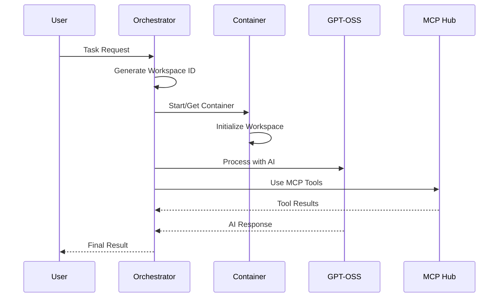

# AI Agent System

Docker-optimized orchestrator architecture for managing container-based AI agents working on repositories.

## Architecture Overview

This system implements an orchestrator-agent architecture where:

- **Orchestrator**: Manages a team of container-based agents
- **Agents**: Each agent works in an isolated container with a specific repository
- **GPT-OSS**: Cost-effective AI processing with OpenAI-compatible API
- **MCP Tools**: Enhanced capabilities through MCP (Model Context Protocol) servers
- **Cloud Deployment**: Optimized for Google Cloud Run with persistent storage

## Features

- 🐳 **Container Isolation**: One container per repository for clean environments
- 🤖 **GPT-OSS Integration**: Self-hosted AI model for cost efficiency
- 🔧 **MCP Tools**: Database, media generation, code assistance, and automation
- ☁️ **Cloud Native**: Designed for Google Cloud Run deployment
- 📦 **Multi-stage Builds**: Optimized Docker images with distroless base
- 🔄 **Dynamic Scaling**: Containers activated on-demand by orchestrator
- 💾 **Persistent Storage**: Google Cloud Storage for repository data

## Quick Start

### Local Development with Docker Compose

1. **Setup Environment**:
   ```bash
   cp .env.example .env
   # Edit .env with your configuration
   ```

2. **Start Services**:
   ```bash
   docker-compose up -d
   ```

3. **Test the System**:
   ```bash
   curl -X POST http://localhost:8080/orchestrate \
     -H 'Content-Type: application/json' \
     -d '{"query": "List files in current directory", "repo_url": "https://github.com/example/repo"}'
   ```

### Production Deployment to Google Cloud

1. **Configure Environment**:
   ```bash
   export PROJECT_ID="your-gcp-project"
   export REGION="us-central1"
   export GCS_BUCKET="your-ai-agent-bucket"
   export LLM_API_KEY="your-api-key"
   ```

2. **Deploy to Cloud Run**:
   ```bash
   ./scripts/deploy.sh
   ```

## Configuration

### Environment Variables

| Variable | Description | Default |
|----------|-------------|---------|
| `PROJECT_ID` | Google Cloud Project ID | - |
| `REGION` | Deployment region | `us-central1` |
| `GCS_BUCKET` | Cloud Storage bucket for repos | - |
| `LLM_API_KEY` | API key for AI model | - |
| `DATABASE_URL` | PostgreSQL connection string | Local postgres |
| `GPT_OSS_URL` | GPT-OSS service endpoint | Auto-configured |

### MCP Servers

The system includes several MCP servers for enhanced capabilities:

- **DB Toolbox**: Database operations and queries
- **GenMedia**: AI-powered media generation
- **Code Assistant**: Code analysis and generation
- **A2A Bridge**: Agent-to-agent communication
- **Computer Control**: UI automation
- **File System**: Advanced file operations
- **Git Tools**: Repository management

## Usage Examples

### Basic Repository Analysis

```bash
curl -X POST $ORCHESTRATOR_URL/orchestrate \
  -H 'Content-Type: application/json' \
  -d '{
    "query": "Analyze the repository structure and create a summary",
    "repo_url": "https://github.com/user/repo"
  }'
```

### Code Generation

```bash
curl -X POST $ORCHESTRATOR_URL/orchestrate \
  -H 'Content-Type: application/json' \
  -d '{
    "query": "Create a Python function to parse JSON files in the data directory",
    "repo_url": "https://github.com/user/data-project"
  }'
```

### Multi-Repository Task

```bash
curl -X POST $ORCHESTRATOR_URL/orchestrate \
  -H 'Content-Type: application/json' \
  -d '{
    "query": "Compare the README files from multiple repositories",
    "files": ["repo1_readme.md", "repo2_readme.md"]
  }'
```

## Development

### Building Docker Images

```bash
# Build all images
docker build -t ai-agent/orchestrator -f Dockerfile.orchestrator .
docker build -t ai-agent/agent -f Dockerfile.agent .
docker build -t ai-agent/gpt-oss -f Dockerfile.gpt-oss .
```

### Running Tests

```bash
# Install development dependencies
pip install -e ".[dev]"

# Run tests
pytest tests/

# Run with coverage
pytest tests/ --cov=services --cov-report=html
```

### Code Quality

```bash
# Format code
black services/

# Lint code
ruff check services/

# Type checking
mypy services/
```

## Architecture Details

### Orchestrator Service

The orchestrator (`services/orchestrator/src/agent.py`) manages:

- Container lifecycle (start/stop/monitor)
- Task distribution to appropriate agents
- Memory management with cognee
- MCP server coordination
- Health monitoring

### Agent Service

Each agent (`services/agent/src/worker.py`) handles:

- Repository cloning and management
- Dependency installation
- Task execution in isolated environment
- File system operations
- Shell command execution

### Container Orchestration Flow



## Cost Optimization

- **GPT-OSS**: Self-hosted model reduces API costs to ~$0.02/hour
- **Container Reuse**: Containers persist to avoid repeated setup
- **Efficient Builds**: Multi-stage Docker builds minimize image size
- **Resource Limits**: Configurable CPU/memory limits per container
- **Auto-scaling**: Containers scale down when idle

## Security

- **Isolated Environments**: Each repository runs in separate container
- **Network Policies**: Restricted container communication
- **Resource Limits**: Prevent resource exhaustion
- **Secret Management**: Environment variables for sensitive data
- **Image Scanning**: Distroless base images for security

## Troubleshooting

### Common Issues

1. **Container Startup Failures**:
   - Check Docker daemon status
   - Verify image availability
   - Review container logs

2. **GPT-OSS Connection Issues**:
   - Verify service health endpoint
   - Check network connectivity
   - Review model configuration

3. **Storage Access Issues**:
   - Verify GCS bucket permissions
   - Check service account credentials
   - Review volume mount configuration

### Debugging

```bash
# Check orchestrator logs
docker logs orchestrator

# Check agent logs
docker logs repo-12345

# Health check
curl http://localhost:8080/health

# List active containers
curl http://localhost:8080/containers
```

## Contributing

1. Fork the repository
2. Create a feature branch
3. Make changes with tests
4. Run quality checks
5. Submit pull request

## License

MIT License - see [LICENSE](LICENSE) file for details.

## Support

For issues and questions:
- Create an issue on GitHub
- Check the troubleshooting guide
- Review logs for error details